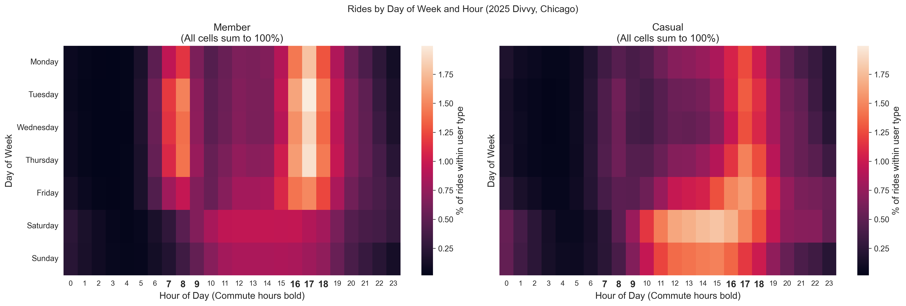
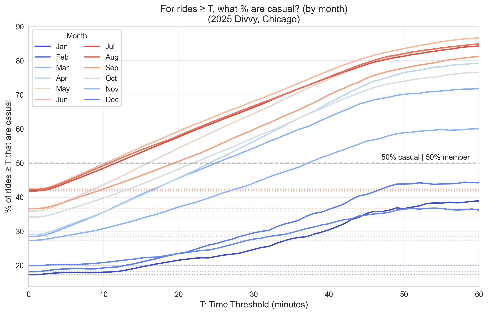

# How are Member and Casual Divvy rides different? (2025)

Divvy is a Chicago bike share system. 

This project analyzes 5.4 million Divvy rides from 2025 to compare how member and casual (non-member) riders use the service through the lenses of ride duration, seasonality, time of day, and day of week.

The analysis was written in Python using Pandas for data processing and Matplotlib/Seaborn for visualization.

## Key findings
- While casual rides make up only 35.5% of total rides, they account for half (50.3%) of rides longer than 18 minutes.
- Member rides consistently show patterns of commute usage, casual rides consistently show patterns of recreational or tourism usage.
- Casual rides are more seasonal than member rides: 70.0% of casual rides occur from May through September vs 57.6% of member rides.

## Project Structure

| File | Description |
|------|-------------|
| [README](README.md) | You are here: Project summary |
| [report](report.ipynb) | Reproducible Jupyter notebook that generated all figures and numbers in this document |
| [CHANGE_LOG](CHANGE_LOG.md) | Details on data removed during cleaning |
| [00_run_pipeline](00_run_pipeline.py) | Run 01 -> 02 -> 03 in sequence | 
| [01_concat](01_concat.py) | Combines 12 months of raw CSV into one table |
| [02_prepare](02_prepare.py) | Feature creation and datetime conversion |
| [03_clean](03_clean.py) | Removes impossible and sub-1-minute rides |

## Data Cleaning

- Raw monthly files were combined and prepared with a simple, reproducible pipeline. 

**Raw data inspection**
- No duplicate rows, or duplicate `ride_id` values found.
- No missing data was found in key analysis columns (`ride_id`, `rideable_type`, `started_at`, `ended_at`, `member_casual`).
- Every entry in the `member_casual` and `rideable_type` columns was validated.

**Removing rides < 60 seconds**
- 99.99% of sub-60s rides were electric (vs 64.92% overall), consistent with users immediately returning a malfunctioning or uncharged electric bike, or system errors. This data is likely not representative of trip behavior and was removed from this analysis.
- Rides 60-120s showed a difference of less than 1% (64.00% vs 64.92%) between electric usage and overall usage, so no further removal was required.

See **Data Cleaning Summary** in [report.ipynb](report.ipynb) for calculations.

**Pipeline Structure**
The pipeline takes 12 months of raw CSV data and processes it into an analysis-ready parquet file for efficient processing of 5.4 million entries.

`00_run_pipeline.py` runs the following in sequence
| Script | Input | Output |
|--------|-------|--------|
| 01_concat | `01_raw_csv/YYYYMM-divvy-tripdata.csv(all 2025)` | `02_processed/01_concat_2025_tripdata.parquet` |
| 02_prepare | `02_processed/01_concat_2025_tripdata.parquet` | `02_processed/02_prepared_2025_tripdata.parquet` |
| 03_clean | `02_processed/02_prepared_2025_tripdata.parquet` | `02_processed/03_cleaned_2025_tripdata.parquet` |

https://github.com/user-attachments/assets/feaac47b-ef6e-4c62-9ab2-c3a22b5a61a2

- See [CHANGE_LOG](CHANGE_LOG.md) for full cleaning details.
- [Data Source Details](#data-source-details) for more on where the data came from.

## Data Overview

- **Dataset**: Divvy rides 2025, based in Chicago.
- **Grain**: Rides are a single completed trip from a Divvy bike, not one unique rider. Frequent riders can contribute more rides overall.

**Ride Counts**

- Total: 5,405,593
- Casual: 1,920,483 (35.5%)
- Member: 3,485,110 (64.5%)

*Fun Fact: In 2025 Divvy users rented bikes for a total of 169 years!*

**Bike Type**

Members and casual riders show similar usage of electric and classic (non-electric) bikes.

| | Classic | Electric | % Electric |
|---|---|---|---|
| Casual | 0.67M | 1.25M | **65.0%** |
| Member | 1.28M | 2.21M | **63.4%** |

**Definitions**

- Casual: a non-member user.
- Member: a member user.
- Classic: a non-powered bicycle.
- Electric: a bicycle with electric pedal assistance.
- Divvy: a Chicago bike share system.
- Weekday Commute Hours: 7:00-9:59 am, 4:00-6:59 pm Mon-Fri.

## Casual rides are more seasonal than member rides

- 70.0% of all casual rides occur from May through September (vs 57.6% of member rides May-Sep), peaking at 42.4% casual share in August (vs 35.5% overall casual share).
- December-February, the lowest usage months, account for 4.05% of casual rides and 9.87% of member rides. This indicates member usage is more consistent year-round.

## When they ride

| | Member rides | Casual rides |
|---|:---:|:---:|
| Highest usage periods | 8:00 - 8:59 am and 5:00 - 5:59 pm weekdays | Weekends and afternoons |
| % of "user type" rides during weekday commute hours | **38.5%** | 25.3% |
| % of "user type" rides during weekends | 23.4% | **37.2%** |

- **Casual rides** are 1.59x more concentrated on weekends than member rides, indicating that casual riders have a higher tendency to use the service for recreation. 
- **Member rides** are 1.52x more concentrated around weekday commute hours than casual rides, indicating that member riders have a higher tendency to use the service for commute purposes.

notes: 
- "Weekday commute hours" defined as: 7:00-9:59 am, 4:00-6:59 pm Mon-Fri
- Heatmap hours use 24-hour clock, so 17 = 5:00–5:59 pm

## How long they usually ride

- **Casual rides** have longer durations (by median) than member rides across both bike types.
- **Casual classic rides** have the longest and most variable ride durations.
    - The middle 50% (IQR) of casual classic rides fall between ~9–31 min vs ~5-16 min for member classic
- **Classic bikes** for both member and casual rides have longer ride durations than electric.

## Long rides have mostly casual riders

- While casual rides make up only 35.5% of total rides, they account for half (50.3%) of rides longer than 18 minutes.
- The further down the tail of the ride duration distribution, the more it becomes dominated by casual rides.
- 80.8% of rides longer than 60 minutes had casual riders.

| Threshold (min) | Member rides ≥ T | Casual rides ≥ T | Casual % ≥ T |
|---:|---:|---:|---:|
| 17 | 676,153 | 659,255 | 49.4% |
| 18 | 607,996 | 615,306 | 50.3% |
| 19 | 547,368 | 575,107 | 51.2% |
| 60 | 23,015 | 96,781 | 80.8% |

*This pattern is consistent with recreational or visitor usage among casual riders*

- In every quarter, casual share rises with ride duration threshold
- Even in Q1 where casual rides are only 23% of all rides, they account for half of rides longer than 36 minutes.
- During the busier quarters Q2 and Q3, the threshold at which casual rides become the majority drops to 15 and 14 minutes respectively

| Season | Baseline casual % | Casual majority threshold (min) |
|--------|--------------------------|----------------------------------|
| Q1 (Jan-Mar) | 23.2 | 36 |
| Q2 (Apr-Jun) | 37.1 | 15 |
| Q3 (Jul-Sep) | 40.3 | 14 |
| Q4 (Oct-Dec) | 30.3 | 29 |

## Conclusions

Overall, casual rides across every stage of this analysis have shown patterns consistent with recreational or tourism-based usage of the Divvy service, while member rides have shown patterns consistent with functional and commute usage.
 
The dataset analyzed contains rides rather than unique users, with no link to unique riders possible, so the data cannot inform on why casual users have not become members. Additional data such as surveys could provide insight to user sentiment.

## Recommendations

### 1: Plan around casual seasonality 

**Supporting Data**
- Casual ride share is highest from May through September, exceeding the overall casual share of 35.5%.
- 70.0% of all casual rides occur May through September, vs 57.6% of member rides.

**Recommendation**
- Member recruitment May through September would take advantage of the casual ride busy season and highest casual share.

### 2: Target weekend casual riders for conversion

**Supporting Data**
- Casual rides are 1.59x more concentrated on weekends than member rides.

**Recommendation**
- Frequent weekend riders would gain value from membership. This group can be targeted with weekend-related promotional material.

### 3: Target casual riders who take long rides

**Supporting Data**
- Casual riders account for half (50.3%) of rides longer than 18 minutes, despite being only 35.5% of total rides.

**Recommendation**
- Frequent long-ride users would gain the most value from a membership, making them a natural recruitment target.

## What I learned

- Building a reproducible data pipeline: This structure will be used in my future and ongoing projects to ensure proper data hygiene.

- Clean separation of raw data processing stages greatly helped with this project. Having access to the data at every stage directly helped with confirming that data with duration < 60s would add bias to my results and should be removed. Separating feature creation into the pipeline simplified creating the report.ipynb notebook from the rough exploratory draft notebook.

- Awareness of the grain: one entry = one interaction with a Divvy bike, independent of user. This informed the entire analysis.

- The value of a full year: Without context as to how busy in season months are and how slow off-season months are, the analysis would run the risk of misrepresenting user behavior.

- Sanity checking findings: casual rider share increasing with ride duration threshold could have been just seasonal volume. Splitting the analysis by quarter confirmed the pattern holds year-round. See appendix for a monthly breakdown.

## Further work

- Interested in joining this dataset with a weather/temperature database. The extra weather context would allow for removing confounding factors in seasonality.
- Spatial data analysis: Latitude-Longitude and Station information present in the raw dataset offer a different lens into casual and member usage. For instance, Navy Pier (recreational area) was the most commonly used station for casual riders, and it saw more usage than any single station members used.

## Data Source Details

- 12 monthly zipped CSV files covering all of 2025, obtained 2/18/2026 from https://divvy-tripdata.s3.amazonaws.com/index.html
- Unmodified zip folders are stored in `00_raw_zip/`, manually extracted to `01_raw_csv/`
- All data is in `./data/`
- License: https://divvybikes.com/data-license-agreement by Motivate International Inc
- Privacy: data is anonymized. No attempt was made to correlate the data with any personal information of customers.
- [CHANGE_LOG](CHANGE_LOG.md): Features added, and data removed during cleaning.

## Appendix

### Monthly casual share by ride duration threshold

*The threshold finding was inspected by month. The pattern holds across all months, though January, February and December do not cross 50% casual within the 60-minute window.*